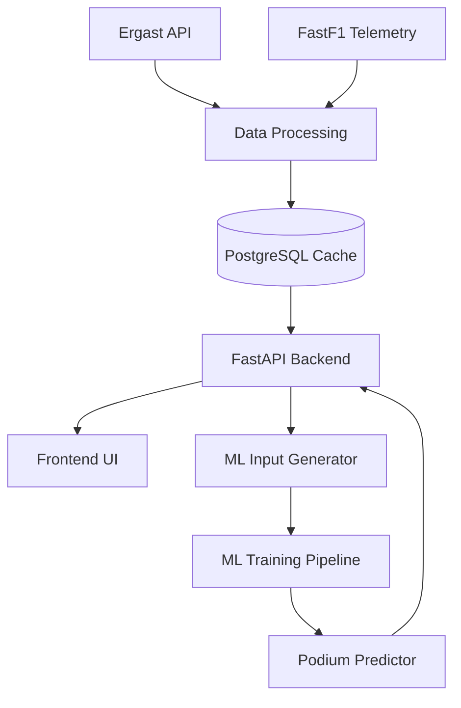

# 📘 Formula 1 Final Thesis — Data Analysis, Telemetry & Podium Prediction Platform

## 🚀 Overview
This project represents a complete software solution developed as part of a final thesis on **Formula 1 data analysis and prediction**.  
It integrates **historical datasets, live-style telemetry**, advanced **machine learning models**, and a custom-built **FastAPI backend** to provide a powerful environment for race analytics and predictions.

The project is divided into two major parts:
- **Formula 1 Final Thesis Project** → Full backend (FastAPI) + frontend  
- **Formula 1 Final Thesis ML** → Machine learning system (LightGBM, XGBoost, RandomForest)

Together, they create a unified platform for:  
✔ Race result analysis  
✔ Driver/constructor insights  
✔ Telemetry visualization  
✔ Sector dominance SVG maps  
✔ Strategy & stint analysis  
✔ Podium prediction using trained ML models  

---

# 🧱 Key Features

### 🔹 FastAPI Backend
- Fully documented Swagger docs (`/docs`)
- Modular endpoints:
  - Drivers  
  - Constructors  
  - Circuits  
  - Results  
  - Standings  
  - Schedule  
- Telemetry endpoints using FastF1
- SVG sector dominance visualizations
- PostgreSQL caching to avoid repeated telemetry downloads

### 🔹 Machine Learning Podium Predictor
- Complete preprocessing pipeline for F1 race data
- Feature engineering:
  - Grid position  
  - Driver & constructor form  
  - Circuit history  
  - Sector performance  
  - Pace deltas  
- Trained models:
  - LightGBM  
  - XGBoost  
  - Random Forest  
- Predicts podium probabilities for each driver

### 🔹 Data Processing Pipeline
- Raw data in `Data/`
- Cleaned Excel data in `DataExcel/`
- ML-ready normalized data in `DataML/`
- Models stored in `Models/`
- Prediction scripts in `Predictor/`

### 🔹 Clean Architecture
- Backend, ML, and data processing are fully separated
- Large cache folders excluded via `.gitignore`
- Prepared for cloud deployment and containerization

---

# 🧰 Tech Stack

### Backend
- Python  
- FastAPI  
- FastF1  
- PostgreSQL  
- psycopg2  
- Uvicorn  

### Machine Learning
- LightGBM  
- XGBoost  
- Random Forest  
- Pandas, NumPy  
- Scikit-learn (GridSearchCV)

### Data Sources
- Ergast API  
- Jolpica CSV datasets  
- FastF1 telemetry  

---

# 📂 Project Structure

```
Formula1FinalThesis/
│
├── Formula 1 Final Thesis Project/
│   ├── Backend/
│   │   ├── api/
│   │   ├── cache/                (ignored in Git – FastF1 cache)
│   │   ├── database/
│   │   ├── models/
│   │   ├── routers/
│   │   ├── utils/
│   │   └── main.py
│   │
│   ├── Frontend/
│   └── ...
│
└── Formula 1 Final Thesis ML/
    ├── Data/                     (raw CSVs)
    ├── DataExcel/                (cleaned data)
    ├── DataML/                   (ML-ready datasets)
    ├── Models/                   (trained models)
    ├── Predictor/                (prediction scripts)
    └── utils/
```

---

# 🏗 System Architecture



---

# ⚙️ Installation

## 1️⃣ Backend Setup (FastAPI)

```bash
cd "Formula 1 Final Thesis Project/Backend"

python -m venv venv
source venv/bin/activate          # Windows: venv\Scripts\activate

pip install -r requirements.txt

# Create .env with:
# DB_HOST=
# DB_PORT=
# DB_USER=
# DB_PASSWORD=
# DB_NAME=

uvicorn main:app --reload
```

📌 Access API documentation:  
**http://localhost:8000/docs**

---

## 2️⃣ Machine Learning Module Setup

```bash
cd "Formula 1 Final Thesis ML"

python -m venv venv
source venv/bin/activate

pip install -r requirements.txt
```

### Train models
```
python train_models.py
```

### Predict podium
```
python predictor/predict_podium.py
```

---

## 3️⃣ Frontend Setup (if applicable)

```bash
cd "Formula 1 Final Thesis Project/Frontend"
npm install
npm run dev
```

---

# 🔌 Key API Endpoints

### 🔹 Driver info
```
GET /drivers/{driver_id}
```

### 🔹 Constructor info
```
GET /constructors/{constructor_id}
```

### 🔹 Race results
```
GET /results/{year}/{round}
```

### 🔹 Telemetry dominance
```
GET /telemetry/{year}/{round}/dominance
```

### 🔹 Podium prediction
```
POST /ml/predict
```

---

# 🤖 Machine Learning Workflow

1. Load raw data → `Data/`  
2. Clean & enhance → `DataExcel/`  
3. Create ML-ready datasets → `DataML/`  
4. Train models (LightGBM, XGBoost, Random Forest)  
5. Save models to `Models/`  
6. Predict via `Predictor/` scripts  
7. Backend integrates predictions  

---

# 🧩 .gitignore Summary

```
fastf1_cache/
Cache/
*.sqlite
*.ff1pkl
__pycache__/
node_modules/
dist/
venv/
.env
```

Prevents upload of large telemetry caches and system files.

---

# 🚀 Future Improvements

- Real-time telemetry ingestion  
- More advanced ML (pit strategy, tyre degradation)  
- Docker & Kubernetes deployment  
- Rich frontend visual dashboard  
- Weather-aware prediction modelling  

---

# 🙏 Acknowledgements

- Ergast API  
- FastF1  
- Pandas / NumPy / Scikit-learn  
- Academic research on motorsport analytics  

---

# 📄 License

MIT or another license can be added here.

---

# 🎉 Final Notes

This repository delivers a complete **Formula 1 analytics ecosystem**, covering:  
➡ data ingestion  
➡ telemetry processing  
➡ backend engineering  
➡ machine learning modelling  
➡ prediction serving  

A full end-to-end demonstration of applied motorsport data science and software architecture.

